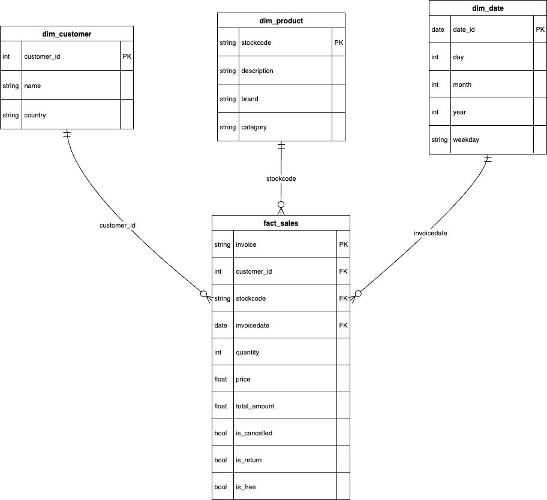
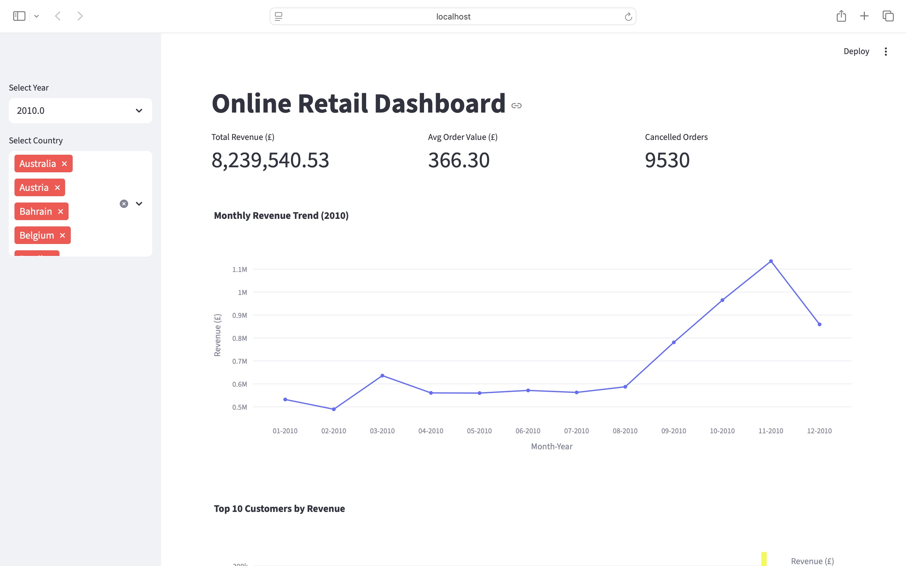

# Online Retail Dashboard

This project is a **data engineering + dashboard pipeline** for an online retail dataset.  
It includes ETL scripts, a Postgres star-schema, and a Streamlit dashboard for KPIs and insights.

## Features

- Star-schema database: `dim_customer`, `dim_product`, `dim_date`, `fact_sales`
- ETL scripts to load data from CSV into Postgres
- Streamlit dashboard with:
  - Total revenue
  - Average order value
  - Cancelled orders
  - Monthly revenue trend
  - Top 10 customers
  - Top 10 products
  - Revenue by country
- Filters by **year** and **country**

## Installation

1. Clone the repo:

git clone <repo-url>
cd online_retail_pipeline

2. Install dependencies:

pip install -r requirements.txt

3. Make sure Postgres is running and the database is loaded with ETL scripts.

4. Change the path in app.py and Run the dashboard:

streamlit run dashboard/app.py

## Directory Structure

online_retail_pipeline/

├── dashboard/        # Streamlit app

├── etl/              # ETL scripts & staging data

├── queries/          # SQL queries used in the dashboard

├── README.md

└── requirements.txt

## Database Schema

The diagram below illustrates the database schema, including tables, columns, and relationships.

## Dashboard Preview

Here is a preview of the project's interactive dashboard.

